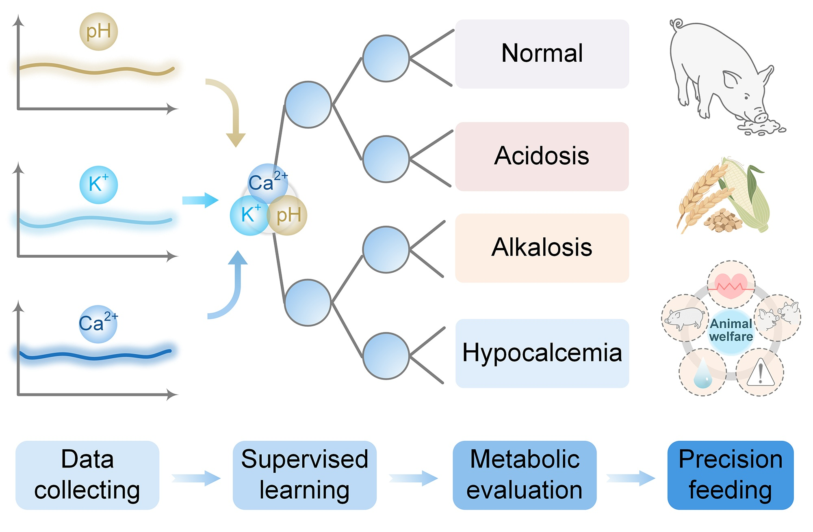

#  Machine Learning-assisted Self-powered Ear Tag for Animal Welfare

---

## **Background & Motivation**
In modern livestock production, animal welfare has become a critical factor influencing livestock health, productivity, and sustainability, and is facing escalating challenges. Among them, disruptions in metabolic homeostasis, particularly electrolyte imbalance caused by improper dietary ratios, can lead to chronic physiological stress, impaired immune function, and prolonged suffering of livestock. These subclinical conditions often persist silently for days or even weeks before overt symptoms emerge. Unfortunately, current welfare assessment methods rely heavily on subjective observation or intermittent, invasive blood sampling, resulting in delayed diagnosis and missed opportunities for early intervention. The latent nature of these injuries often leads to irreversible harm or even mortality. Therefore, there is an urgent need for dynamic, real-time, and sustainable diagnostic tools to monitor metabolic health and endocrine responses in livestock.

---

## **Introduction**
We have developed a machine learning-assisted self-powered ear tag (iSPET), the highly integrated and lightweight wearable platform that combines hybrid energy harvesting, multiplexed biosensing, and machine learning (ML)-driven metabolic assessment. Considering the complex behavior of livestock and rearing environments, a hybrid self-powered module combines triboelectric nanogenerator (TENG) and solar cell is designed for efficient energy harvesting. Among them, TENG is used to obtain the kinetic energy of livestock to compensate for the output decline caused by insufficient light intensity, while solar cell is adopted to ensure the continuous energy supply when the light intensity is stable. The lightweight and biocompatible microneedle array enables continuous monitoring of pH, K⁺ and Ca²⁺ levels in the interstitial fluid of livestock. With the assistant of ML model, the metabolic states of normal, acidosis, alkalosis, and hypocalcification are accurately distinguished, with a nearly perfect average accuracy of 98.95%. The core innovations of this work are as follows:
Scientific and technological innovations:
- For the first time, an intelligent ear tag specifically focusing on livestock welfare is invented. The iSPET tag is lightweight (<20 g), robust, and seamlessly integrates with conventional ear-tagging methods. It empowers livestock caretakers with continuous, actionable insights to prevent metabolic disorders, optimize feeding strategies, and uphold welfare standards before clinical symptoms arise.
- For the first time, a multiplexed biosensor is specifically designed for livestock, which continuously monitor interstitial fluid pH, K⁺, and Ca²⁺ with laboratory-grade precision (blood test correlations: 0.94, 0.93, 0.89). Coupled with an XGBoost-based metabolic assessment model achieving 97.87-99.73% accuracy in classifying normal/abnormal states (acidosis, alkalosis, hypocalcemia). The iSPET establishing a new paradigm in continuous biochemical monitoring without repeated invasive procedures.
- A self-powered module, specially designed for livestock habits and breeding environments. A synergistic TENG-solar system that leverages livestock motion kinetics and ambient light to achieve uninterrupted power indoors or outdoors. The synergistic approach ensures uninterrupted, functionality both indoors and outdoors in diverse farm environments, eliminating the fundamental limitation of battery dependence in long-term livestock wearables.

The iSPET platform is an integrated, field-deployable device that converges sustainable energy harvesting, minimally invasive biosensing, and diagnostic AI to enable precision livestock farming and elevate global animal welfare. 

---

## **How to Use**
1. Clone the Repository: https://github.com/Xiaoyu-408/ear-tag-ml
2. Prerequisites: Python 3.8; shap 0.44.1

---

## **Machine Learning Workflow**

*Fig. 1. Biosensing signals → preprocessing → ML classifier (XGBoost) → metabolic state classification.*

